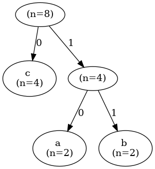

# Introduction

`zoid-zip` is a tiny data compressor built for learning!

# Setup

```
pnpm install
```

(or npm or yarn)

# To Try

Either run

- `pnpm exec vite-node index.ts` - to try the hardcoded input

Or run

- `cat index.ts | pnpm exec vite-node index.ts compress | pnpm exec vite-node index.ts decompress` - to use any arbitrary output!

---

# Table of Contents

<!-- toc -->

- [Build Your Own Data Compressor](#build-your-own-data-compressor)
- [Theory](#theory)
  * [Huffman Coding](#huffman-coding)
  * [Tree Serialization](#tree-serialization)
  * [Trie Search](#trie-search)
- [Compression and Decompression](#compression-and-decompression)
  * [Compression](#compression)
  * [Decompression](#decompression)
- [Conclusion](#conclusion)
- [Fun](#fun)
  * [Here is an example huffman-coding tree for this input](#here-is-an-example-huffman-coding-tree-for-this-input)

<!-- tocstop -->

# Build Your Own Data Compressor

I wrote this during my time at [the Recurse Center](https://recurse.com)! for learning about data compressors. Let's dive in.

# Theory

Data compression is a sub topic of information theory! We will dive right into the theory needed to write a compressor and hopefully the experience of building this compressor will get you more interested in information theory in general.

Let's start with why compression? Data compression is all around us:

- Image, audio, video files use compression to store more data using less storage space
- Internet is powered by data compression, the less bytes you transfer over the network, the faster your user can see content

Note: compression is a tradeoff between storage/network transport vs compute, we can compress data into a smaller amount of bytes, making it easier to transfer over the network, but the client needs to use more "compute" once it has downloaded a compressed package.

## Huffman Coding

Let's say you want to compress the string: "ababcccc". The first thing we need to do is to find a way to encode the individual characters into a representation that takes less space than the original (this is called "variable length coding"). One of the most scalable ways of doing that is to use [Huffman coding](https://en.wikipedia.org/wiki/Huffman_coding).

Huffman coding works by making a frequency table of the characters (leaf nodes) in the input, so in our case that would look like

| Char | Frequency |
| ---- | --------- |
| a    | 2         |
| b    | 2         |
| c    | 4         |

Then it joins the last two nodes with most frequency by having a common internal node as the parent, repeating this process until there is no leaf node remaining.

For our input, "ababcccc", it will look like the following:



and here is a step by step animation of how the algorithm constructs this tree:


Once we have the Huffman coding, we can encode input characters into bits, by tracing the path up to the leaf node. In our case, it looks like the following

| Char | Encoding |
| ---- | -------- |
| a    | 10       |
| b    | 11       |
| c    | 0        |

We can already see a pattern emerging, the most frequent characters (c in our case), is closer to the root and is represented by less bits. The less frequent characters like a, b are further away from the root.

Another property of Huffman coding is that the prefixes are not shared by characters! Which means any traversal of the tree to a leaf node is unique and no other traversal will be a substring of another traversal. This would be useful in decoding, because while decoding we won't know "how many" bits to read as the encoding length is variable.

So, to encode the string

"ababcccc", we need the following bit pattern

|      |     |     |     |     |     |     |     |     | total size                          |
| ---- | --- | --- | --- | --- | --- | --- | --- | --- | ----------------------------------- |
| char | a   | b   | a   | b   | c   | c   | c   | c   | 8 bytes                             |
| bits | 10  | 11  | 10  | 11  | 0   | 0   | 0   | 0   | 12 bits = 1 byte + 4 bits = 2 bytes |

This shows that essentially, if we are able to encode our string using Huffman coding, we will be able to reduce its size!

But there are some challenges with decoding! While decoding, we will need access to this tree "somehow". The way we will do that is by packing the tree with the data while compressing!

It works by creating a /prefix tree for the input data! Then compressing by encoding

1. input length
2. Huffman coding as a table (its length, each byte, size of bits, actual bits)
3. encoded original data

The decompressor works by decoding the input length, extracting the Huffman coding table from the compressed blob and re-constructing the input!

## Tree Serialization

To also pack the tree with the compressed data, we need to serialize it. Tree serialization and de-serialization means representing the tree in "bytes", putting it in the compressed binary and re-constructing the tree when decompressing.

To serialize a Huffman coding tree, we can run a pre-order tree traversal on it, and add a special byte (ASCII `31` aka unit separator) for internal non-leaf nodes.

Here is how it looks like for our example tree:


Pre-order tree traversal: [31, c, 31, a, b]

We also need to "know" how many bytes represent the traversal and we need to store that information, that would take one byte.

## Trie Search

When decoding "unknown" number of bytes, we will use [Trie search algorithm](https://en.wikipedia.org/wiki/Trie) to decode the bits fast. Luckily, Huffman coding tree is also a prefix tree i.e. Trie search algorithm can be applied on it without any code changes.

# Compression and Decompression

With the information we derived in the previous sections, we are ready to perform compression and then decompression.

## Compression

We first store the length of the input data in 4-byte (input can be of a huge length).

compressed binary:

```
00001000 08 # Input data length, 4 bytes
00000000 00
00000000 00
00000000 00
```

Then we add the length of tree traversal in 1-byte (we only support ASCII in input right now, that means the maximum number of characters can be 255). (Note: this needs to be 2 I think, while maximum number of leaf nodes is 255, including a special ASCII character for internal nodes in tree traversal [more on this later], the tree traversal length might be >255)

compressed binary:

```
00001000 08 # Input data length, 4 bytes
00000000 00
00000000 00
00000000 00

00000101 05 # Length of the tree traversal, 1-byte
```

Then we add the 5 bytes of the traversal: [31, c, 31, a, b]

compressed binary:

```
00001000 08 # Input data length, 4 bytes
00000000 00
00000000 00
00000000 00

00000101 05 # Length of the tree traversal, 1-byte

00011111 1F # Tree traversal, 5 items of 1-byte each = 5-bytes
01100011 63
00011111 1F
01100001 61
01100010 62
```

1F, 63, 1F, 61, 62 are just hex reprentation of 31, c, 31, a, b. Please refer to the following table

| Char           | ASCII | Hex | Binary   |
| -------------- | ----- | --- | -------- |
| Unit Separator | 31    | 1F  | 00011111 |
| a              | 97    | 61  | 01100001 |
| b              | 98    | 62  | 01100010 |
| c              | 99    | 63  | 01100011 |

Total size so far: 10 bytes

At this point, we can already see that for this small example string, we are expanding the data i.e. we are using more bytes than the original input string of 8-bytes already just to store the metadata. As the input starts getting larger, we start to see the advantages of compression. This "small" example is just for the demonstration of the process.

Moving on, let's start packing the data: "ababcccc". This is where things get interesting and instead of packing data at byte level, we pack them as closely as possible with bits.

After packing the first "a" (i.e. `10` bits, remaining string: "babcccc"). Note that we are using the [little-endian](https://en.wikipedia.org/wiki/Endianness) encoding.

Compressed binary

```
00001000 08 # Input data length, 4 bytes
00000000 00
00000000 00
00000000 00

00000101 05 # Length of the tree traversal, 1-byte

00011111 1F # Tree traversal, 5 items of 1-byte each = 5-bytes
01100011 63
00011111 1F
01100001 61
01100010 62

00000001 01 # data "a" packed
```

After packing the next "b" (i.e. `11` bits, remaining string: "abcccc"). Note that we are using the little-endian encoding.

```
00001000 08 # Input data length, 4 bytes
00000000 00
00000000 00
00000000 00

00000101 05 # Length of the tree traversal, 1-byte

00011111 1F # Tree traversal, 5 items of 1-byte each = 5-bytes
01100011 63
00011111 1F
01100001 61
01100010 62

00001101 0D # data "ab" packed
```

Similarly, packing the remaining string "abcccc" yields the following compressed binary!

```
00001000 08 # Input data length, 4 bytes
00000000 00
00000000 00
00000000 00

00000101 05 # Length of the tree traversal, 1-byte

00011111 1F # Tree traversal, 5 items of 1-byte each = 5-bytes
01100011 63
00011111 1F
01100001 61
01100010 62

11011101 DD # data "ababcccc" packed
00000000 00
```

To be able to pack bits and bytes like this, we will need an abstraction that allows us to easily read/write bits and bytes. This can be seen in [binary-utils](./binary-utils/) folder.

## Decompression

Decompression will consist of reading bytes for metadata and unpacking bits for the actual data then dropping the "processed bits". From the final compressed binary, it will first read the input data length!

Data length, read the first 4 bytes = 8

remaining compressed binary:

```
00000101 05 # Length of the tree traversal, 1-byte

00011111 1F # Tree traversal, 5 items of 1-byte each = 5-bytes
01100011 63
00011111 1F
01100001 61
01100010 62

11011101 DD # data "ababcccc" packed
00000000 00
```

Read tree traversal length, 1 byte = 5

remaining compressed binary:

```
00011111 1F # Tree traversal, 5 items of 1-byte each = 5-bytes
01100011 63
00011111 1F
01100001 61
01100010 62

11011101 DD # data "ababcccc" packed
00000000 00
```

Read the contents of the traversal i.e. 5-bytes = [31, c, 31, a, b]

remaining compressed binary:

```
11011101 DD # data "ababcccc" packed
00000000 00
```

Construct the Huffman tree from the traversal.

Loop up to data length i.e. 8! Extract 8 bytes one-by-one. This one is a bit tricky, since the encoding length is variable, we need to use the following algorithm

1. We "peek" n bits (starting at 1), and find it in tree (using Trie search)
2. If we end up on a leaf node, we return the "char" on the leaf node
3. Otherwise, we "peek" n + 1 bits and continue at step 2

so after extracting "a" the binary looks like

remaining compressed binary:

```
00110111 37
  000000 00
```

after extracting "ab" the binary looks like

remaining compressed binary:

```
00001101 0D
    0000 00
```

so after extracting "abab" (next 2 chars) the binary looks like

remaining compressed binary:

```
00000000 00
```

so after extracting "ababcccc" (next 2 chars) the binary looks like

remaining compressed binary:

```
    0000 00
```

At this point, we have successfully decompressed our input string. 4-bits remain in the binary which we simply discard.

# Conclusion

I hope this gave you a glimpse into how data compressors are built. Our data compressor is still pretty slow and just a toy compared to the production ready data compressors.

Most real world compressors use [LZ family of algorithms](https://en.wikipedia.org/wiki/LZ77_and_LZ78) in conjuction with Huffman coding.

# Fun

## Here is an example Huffman coding tree for this input

```
a
bb
ccc
dddd
eeeee
ffffff
ggggggg
hhhhhhhh
iiiiiiiii
jjjjjjjjjj
kkkkkkkkkkk
llllllllllll
mmmmmmmmmmmmm
nnnnnnnnnnnnnn
ooooooooooooooo
pppppppppppppppp
qqqqqqqqqqqqqqqqq
rrrrrrrrrrrrrrrrrr
sssssssssssssssssss
tttttttttttttttttttt
uuuuuuuuuuuuuuuuuuuuu
vvvvvvvvvvvvvvvvvvvvvv
wwwwwwwwwwwwwwwwwwwwwww
xxxxxxxxxxxxxxxxxxxxxxxx
yyyyyyyyyyyyyyyyyyyyyyyyy
zzzzzzzzzzzzzzzzzzzzzzzzzz
```


And how this is constructed


